# h3 Demoni
[Tero Karvinen, Palvelinten hallinta 2026 period 4, late spring: h3 Demoni](https://terokarvinen.com/palvelinten-hallinta/)

## Ympäristö
Virtuaalikone
- Debian 13.4.0 Desktop 64-bit
- 4096MB basememory
- 1 vCPU
- Intel NAT verkkoadapteri
- Oletus selain Firefox

Ansible
- 2.19.4 version

Python
  - 3.13.5 version

## x) Lue ja tiivistä. 
> (Tässä x-alakohdassa ei tarvitse tehdä testejä tietokoneella, vain lukeminen tai kuunteleminen ja tiivistelmä riittää. 
> Tiivistämiseen riittää muutama ranskalainen viiva. 
> Ei siis vaadita pitkää eikä essee-muotoista tiivistelmää. Lisää kuhunkin jokin oma kysymys tai huomio.)

### Karvinen 2026: [Apache installed with Ansible - quick notes](https://terokarvinen.com/apache-ansible/)
- 
- 
- 
### Ansible Community Documentation: [Handlers: running operations on change](https://docs.ansible.com/projects/ansible/latest/playbook_guide/playbooks_handlers.html)
- 
- 
- 

### ansible-doc service
- johdantokappale (MODULE alta)
- enabled
- name
- state
- EXAMPLES

## a) Apassi. Asenna Apache 2 käsin. 
> Weppisivun tulee näkyä palvelimen etusivulla. Sivun tulee olla tavallisen käyttäjän muokattavissa, ilman root- tai sudo-oikeuksia.

### Ladataan Apassi!
Minulla on onneksi apassi valmiina, mutta lukioiden iloksi sen saa ladattua: 
```
sudo apt install apache2
```
Vilkaistaanpa, että apache on käynnissä komennolla:
```
sudo systemctl status apache2
```
Jos käynnissä => HYVÄ! 
Sitten vakiosivut pitäisi löytyä "http://localhost".

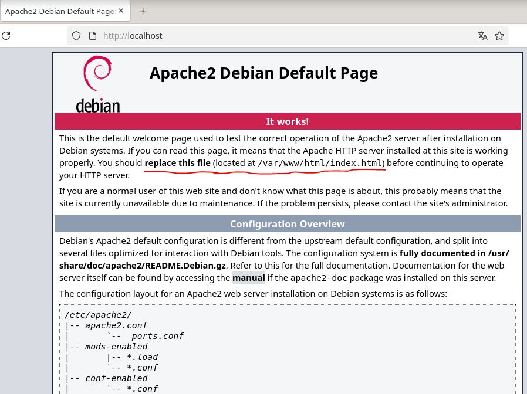
### Käyttöoikeudet
Jotta kaikilla käyttäjillä olisi kivaa, niin laitetaan oikeudet kuntoon.

Aluksi ne näyttävät tältä. Vakiosivu sijaitsee polussa /var/www/html/index.html. Index.html on vakio sivu.

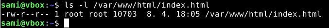

```
-rw-r--r--
```
Nyt käyttäjät pääsee vain lukemaan ja tämähän ei tule kuuloonsa. Annetaan kaikille pääsy lukemaan ja ajamaan tiedostoja. Sitten annetaan vakiosivulle sellaiset pääsyoikeudet, että vaikka testi Pena pääsee sinne runoilemaan. Eli siis muokkaamaan tiedostoa ilman sudoa.

Hakemistolle:

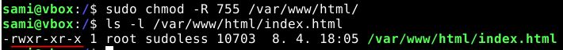
```
-R, tekee oikeuden muutokset koko hakemisto polulle
```
```
ls -l, tulostaa listauksen pitkässä muodossa, jotta nähdään myös oikeudet.
```
Tiedostolle:

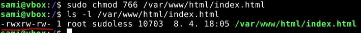

Kokeillaan pääseekö testi Pena testaamaan hakemistoon uusien tiedostojen tekemistä. Ei pääse!

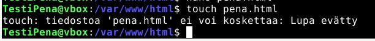

Entäpä muokkaamaan? Kyllä pääsee!

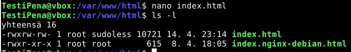


Go, Pena!

## b) Moottorix. Asenna Nginx käsin. 
> Weppisivun tulee näkyä palvelimen etusivulla. Sivun tulee olla tavallisen käyttäjän muokattavissa, ilman root- tai sudo-oikeuksia. (Muista sammuttaa Apache ensin.)

Apache kiinni komennolla:
```
sudo systemctl stop apache2
```
### Ladataan nginx.
Minulla jo löytyy nginx, mutta näin se menisi jos ei olisi:
```
sudo apt install nginx
```

![install nginx](imagesh3/install_nginx.JPG
### Potkitaan se käyntiin
```
sudo systemctl start nginx
```
Sitten vakiosivut pitäisi löytyä "http://localhost"


Vakiosivut näköjään ovat oletuksena samassa hakemistossa. Siksi varmaankin index.html tiedosto näkyy molemilla palvelimilla.

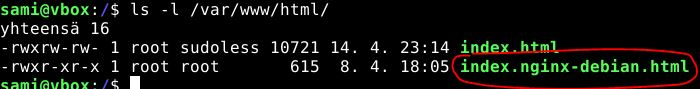

Jos annan uuden konfiguraation nginx:lle, ehkä se ratkeaa.

### Laitetaan uusi hakemisto nginx:lle ja kopioidaan sen vakiosivu sinne sekä muutetaan sille samat oikeudet kuin apachelle. Sitten konfiguraatiot.
```
mkdir /var/www/nginx
```

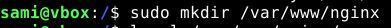
```
sudo cp /var/www/html/index.nginx-debian.html /var/www/nginx/
```
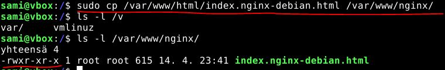

Sitten annetaan samat oikeudet kuin apachen vakiosivulle ja hakemistolle.

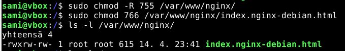

### NGINX KONFIGUROINTI
Nginx:n vakiosivun konfiguraatio tiedosto löytyy /etc/nginx/sites-available/default.

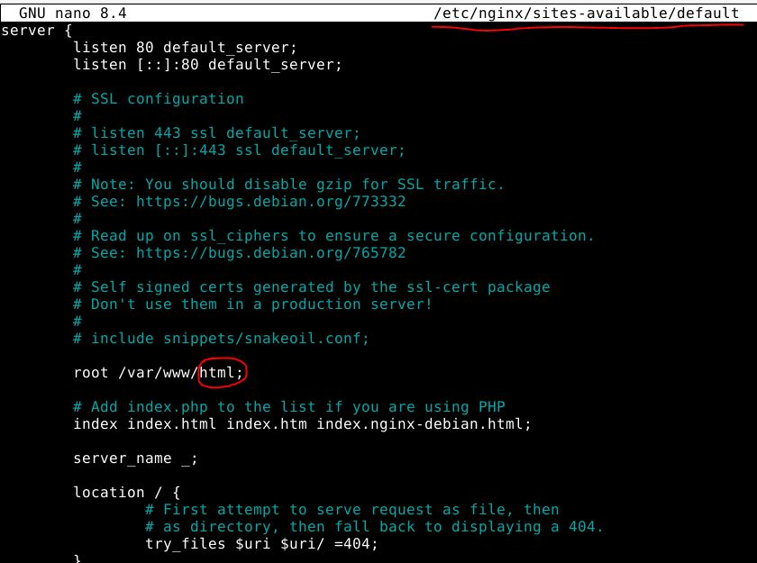

Muutetaanpas sitä, että hakemisto on oikein. Eli vaihdetaan "root  /var/www/html" lopusta "html" => "nginx".
"root  /var/www/nginx"

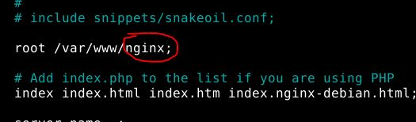

### Nginx uudelleen käynnistys, jotta muutokset tulevat voimaan. 
```
sudo systemctl restart nginx
```
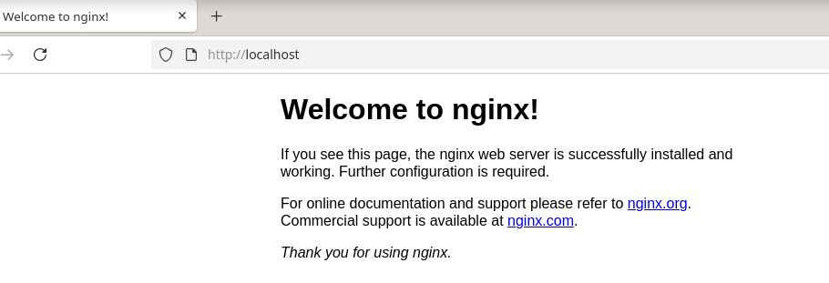

Ja näin se onnistui!

## c) Automoottorix. Automatisoi Nginx asennus Ansiblella. 
> Ylläpitäjän osuus Ansiblella riittää, itse HTML-weppisivut voi tehdä käsin.


## d) Vapaaehtoinen bonus: Osiris-T. Osiris-T asentaa Wazuhin ja tarvittavat virtuaalikoneet. 
> Voit lähettää vihamielistä verkkoliikennettä (tcpreplay), siepata sen (suricata) ja saat tulokset suoraan dashboardille (wazuh).
> Enemmän alpha kuin se kreikkalainen kirjain. Mutta Oskari, Nico ja Arttu ilahtuvat, jos kokeilet.
> Häkämies, Saario, Mukkula 2026: [Osiris-T](https://github.com/oskarihakamies/IDS-project). Häkämies etal 2026: [How to Install](https://github.com/oskarihakamies/IDS-project/blob/main/How-To-Install.md).


## Lähdeluettelo
- Karvinen 2026: Apache installed with Ansible - quick notes(https://terokarvinen.com/apache-ansible/)
-  Ansible Community Documentation: Handlers: running operations on change (https://docs.ansible.com/projects/ansible/latest/playbook_guide/playbooks_handlers.html)
-  Häkämies, Saario, Mukkula 2026: Osiris-T(https://github.com/oskarihakamies/IDS-project)
-  Häkämies etal 2026: How to Install (https://github.com/oskarihakamies/IDS-project/blob/main/How-To-Install.md)
