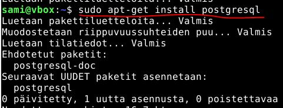
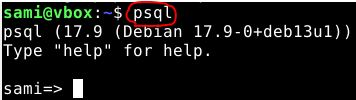
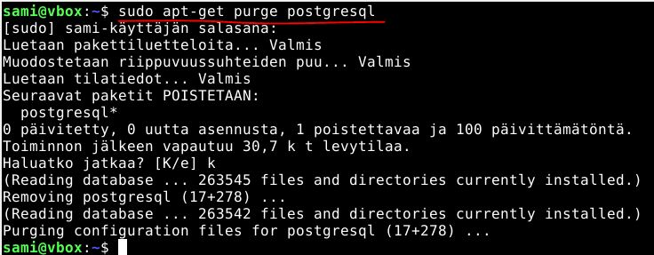

# h4 Pizza Fantasia
[Tero Karvinen, Palvelinten hallinta 2026 period 4, late spring: h4 Pizza Fantasia](https://terokarvinen.com/palvelinten-hallinta/)

## x) Lue ja tiivistä. 
> (Tässä x-alakohdassa ei tarvitse tehdä testejä tietokoneella, vain lukeminen tai kuunteleminen ja tiivistelmä riittää.
> Tiivistämiseen riittää muutama ranskalainen viiva. Ei siis vaadita pitkää eikä essee-muotoista tiivistelmää.
> Lisää kuhunkin jokin oma kysymys tai huomio.)
### Karvinen 2023: Configuration Management of Distributed Systems over Unreliable and Hostile Networks (pdf, ̣mirrors: local, archive.org)
[Karvinen 2023: Configuration Management of Distributed Systems over Unreliable and Hostile Networks](https://westminsterresearch.westminster.ac.uk/item/w7vvz/configuration-management-of-distributed-systems-over-unreliable-and-hostile-networks)
- 4.12.1 Size and Complexity of Some DSLs (112. Ominaisuuksien määrä.)
  - Salt ja puppet työkalujen käyttämät "Domain spesific language" ovat todella isoja ja monimutkaisia.
  - Nämä kielet sisältävät valtavan määrän funktioita, jotka ohjaavat agentti-koneiden olotilaa.
  - Ne kielet kuitenkin käyttää erilaisia hallinta rakenteita ("Control structures").

Millä tavalla esim. Ansible tai terraform vertaavat "DSL" monimutkaisuudessa? Onkohan niillä isommat määrät ominaisuuksia?
    
- 4.12.2 Use of DSL Functions in Case Configuration (112-115. Mitä oikeasti käytetään.)
  - Funktioita on todella iso määrä, mutta mitkä ovat niistä tarpeellisimmat?
  - Tiedostojen manipulointi(file), palveluiden käyttö(service), tiedostojen suorittaminen(exec) ja pakettien asennus(package) ovat suosituimpia ominaisuuksia.
 
- 4.12.3.1 Dependencies Between Main Functions (115-117. Tärkeimmät rakennuspalikat.)
  - Perustoimintojen riippuvuuksia.
  - Esim. palvelimien pystytys käyttää package, file ja service toimintoja.
  - Esim. käyttäjien hallinta käyttää user ja group toimintoja.
  - Monimutkaisemmat toiminnot voidaan rakentaa perustoimintojen päälle kuten file ja exec.
  - Idempotenssi: Tehdään muutoksia vain jos järjestelmä ei ole vielä oikeassa tilassa.
  
Millähän tavalla file ja exec yms. on päätetty rakentaa ansibleen?
 
## Tähän tulee lisää tehtäviä!

## a) Räpylä. Asenna itse valitsemasi demoni käsin. (Lisätty 22.4.2026)
> Jokin muu kuin tunnilla tai kotitehtävissä aiemmin asennettu, eli ei apache, ngninx eikä openssh-server. Kuten aina, testaa lopputulos.
### Minä haluaisin postgreSQL palvelimen.
Olen paljon kuullut puhuttavan postgreSQL tietokannasta ja nyt voisin vähän testailla sitä.
Apt-työkalun kautta lataamiselle ohjeet, [PostgreSQL, Linux Ubuntu download](https://www.postgresql.org/download/linux/ubuntu/). Lataus komennolla:
```
apt install postgresql
```


Kuten kuvasta näkyy, apt työkalu on aloittanut lataamaan tarvittavaa pakettia ja sen riippuvuuksia. Hetken päästä, kun lataus on valmis, testaan päästä ohjelmaan sisään.
Tämän postgresql manuaalin mukaan [PostgreSQL 18.3 Documentation: 1.4. Accessing a Database](https://www.postgresql.org/files/documentation/pdf/18/postgresql-18-A4.pdf), tietokantapalvelinta voi käyttää komennolla:
```
psql <db_nimi>
``` 
En ole vielä tehnyt tietokantaa, mutta luulisin pääseväni kuitenkin sisään määrittämättä mitä tietokantaa haluan katsella. Kokeillaan pelkää "psql".



Komentoriville avautui postgre istunto ja näen käytössä olevan version "17.9 Debian". Manuaalissa on esimerkkinä samankaltainen tilanne kohdassa 1.4:
```
psql (18.3)
Type "help" for help.
mydb=>
```
### Sanon, että paketin lataaminen onnistui ja postgresql käynnistyi.

## b) Automaatti. Automatisoi valitsemasi demonin asennus Ansiblella. 

Tarvitsen tähän tehtävään roolin jota suorittaa ja tehtävät joita rooli suorittaa. Pitää ladata postgresql ja haluan sen heti käyntiin, jotta myöhemmässä vaiheessa voin varmistua sen toiminnasta eri asetuksilla.

### Teen rooli hakemiston "postgre" ja sille ali-hakemiston "tasks". 
Tasks hakemistoon kirjoitan main.yml tiedoston, joka vastaa suoritettavista konfiguraatioista.

Tällä komennolla teen tarvittavat hakemistot:
```
mkdir -p roles/postgre/tasks
```


### Teen main.yml konfiguraatio tiedoston tasks hakemistoon.
Kirjoitan tiedoston micro koodieditorilla:
```
micro main.yml
```
Tarvittava sisältö:
```
- apt:
    name: postgresql
    state: present
    update_cache: true

- service:
    name: postgresql
    state: started
```


main.yml tiedoston kohta, "update_cache" määrittää, että apt-työkalun välimuisti pitää päivittää. Tätä vastaava komento ansiblen ulkopuolella on "apt-get update".
[Ansible community documentation, ansible.builtin.apt module – Manages apt-packages (https://docs.ansible.com/projects/ansible/latest/collections/ansible/builtin/apt_module.html) Tämä ei ole välttämätön ominaisuus tälle tehtävälle, mutta yleisesti hyvä käyttää. Haluaisin ainakin aina uusimman version ladattavista paketeista.


## c) Asetus. Muuta asetustiedostoa herralla (master, "control node") ja aja ansible uudestaan. 
> Osoita, että asetukset tulivat käyttöön.


## d) Paikka remonttiin. Riko jotain asetuksia. 
> Voit esimerkiksi poistaa demonin 'sudo apt-get purge foobar' (purge poistaa myös asetustiedostoja), poistaa asennuksen yhteydessä tulevan kansion (sudo rm -r /etc/foobar/ # vaarallista) tms.
> Ja sitten ajaa ansible-roolisi uudestaan ja todeta, että se korjaa tilanteen.

```
sudo apt-get purge postgresql
```


## e) Idempotentti. Osoita, että tilasi on idempotentti.

## Lähdelutettelo:
- Karvinen 2023: Configuration Management of Distributed Systems over Unreliable and Hostile Networks (https://westminsterresearch.westminster.ac.uk/item/w7vvz/configuration-management-of-distributed-systems-over-unreliable-and-hostile-networks) (Luettu 21.4.2026)
- PostgreSQL, Linux Ubuntu download (https://www.postgresql.org/download/linux/ubuntu/) (Luettu 22.4.2026)
- PostgreSQL 18.3 Documentation: 1.4. Accessing a Database (https://www.postgresql.org/files/documentation/pdf/18/postgresql-18-A4.pdf) (Luettu 22.4.2026)
