# h5 Gitar Hero
[Tero Karvinen, Palvelinten hallinta 2026 period 4, late spring: h5 Gitar Hero](https://terokarvinen.com/palvelinten-hallinta/)

## Ympäristö
Virtuaalikone
- Debian 13.4.0 Desktop 64-bit
- 4096MB basememory
- 1 vCPU
- Intel NAT verkkoadapteri
- Oletus selain Firefox

Git versio 2.47.3

## x) Lue ja tiivistä.
> (Tässä x-alakohdassa ei tarvitse tehdä testejä tietokoneella, vain lukeminen tai kuunteleminen ja tiivistelmä riittää.
> Tiivistämiseen riittää muutama ranskalainen viiva.
> Kannattaa lisätä mukaan myös jokin oma havainto, idea tai kysymys.)

### Chacon and Straub 2014: Pro Git, 2ed: [1.3 Getting Started - What is Git?](https://git-scm.com/book/en/v2/Getting-Started-What-is-Git%3F)

- Git on version hallinta järjestelmä.
- Git ottaa tilannekuvia (snapshot) tiedostoista ja tallentaa ne. Sillä tavalla se luo versiohistoriaa.
- Tiedostoja joita ei muutettu Git ei tallenneta uudelleen.
- Git tallentaa muutoksia paikallisesti koneella, ja kun pääsy verkkoon onnistuu niin git lähettää muutokset projektikansioon.
- Tiedostojen eheyttä Git seuraa checksumien avulla.

Omasta kokemuksesta, Git on melko kätevä sillä tallennettuihin tilannekuviin voi aina palata, jos muutokset tekevät epätoivotun lopputuloksen.


### Gitin käyttö on lähinnä 'git add --all && git commit; git pull && git push'. 
> Selitä tuon komennon jokainen osa. Käytä apuna itse valitsemiasi lähteitä ja viittaa niihin.

Chacon and Straub 2014: Pro Git, 2ed: [A3.3 Git Commands - Basic Snapshotting](https://git-scm.com/book/en/v2/Appendix-C:-Git-Commands-Basic-Snapshotting):
- git add: valitsee tiedostot seuraavaan commit komentoon. 
- git commit: Luo uuden tilannekuvan tiedostoista.

Chacon and Straub 2014: Pro Git, 2ed: [A3.5 Git Commands - Sharing and Updating Projects](https://git-scm.com/book/en/v2/Appendix-C:-Git-Commands-Sharing-and-Updating-Projects):  
- git pull: Noutaa etäkansiosta (remote repository) tiedostot, jotka puuttuvat versiohaarastasi ja sovittaa ne siihen. 
- git push: Melkein sama kuin pull, mutta toimii toiseen suuntaan.

## a) Online. Tee uusi varasto GitHubiin (tai Gitlabiin tai mihin vain vastaavaan palveluun).
> Varaston nimessä ja lyhyessä kuvauksessa tulee olla sana "sunshine". Aiemmin tehty varasto ei kelpaa. 
> (Muista tehdä varastoon tiedostoja luomisvaiheessa, esim README.md ja GNU General Public License 3) 
> Edistyneemmille voi olla hauskaa etsiä ja kokeilla jokin muu palvelu kuin Github.

### Luon uuden varaston githubiin.
Käyttäjäni kotisivulla painan oikeasta yläkulmasta plusmerkin kuvasta ja valitsen "repository", luodakseni uuden varaston.

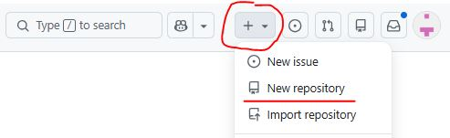

Minulle aukeea sieltä näkymä, jossa pääsen nimeämään varaston, antamaan sille kuvauksen, lisäämään README-tiedoston ja lisäämään omavalintaisen tekijänoikeus lisenssin.

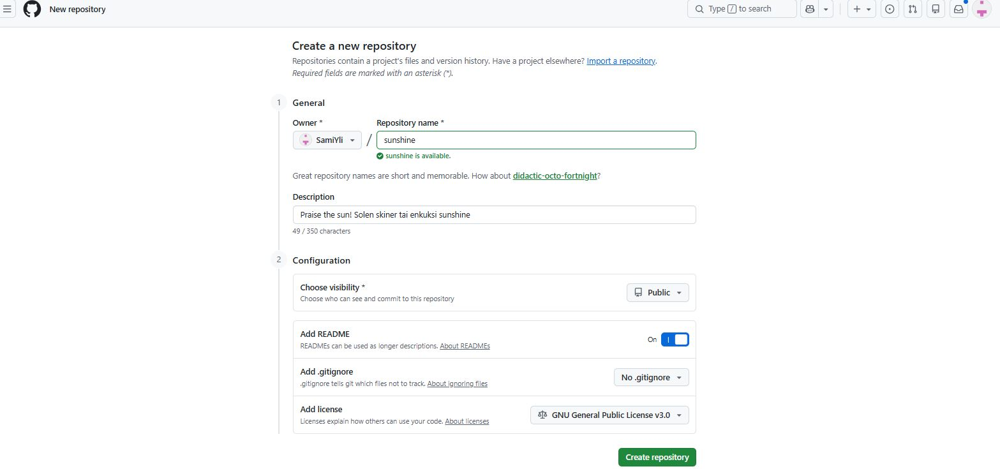

Sitten luodaan painamalla "Create repository". Nyt minulla on uusi varasto nimellä sunshine ja siellä on readme tiedosto sekä GNU General Public License 3.

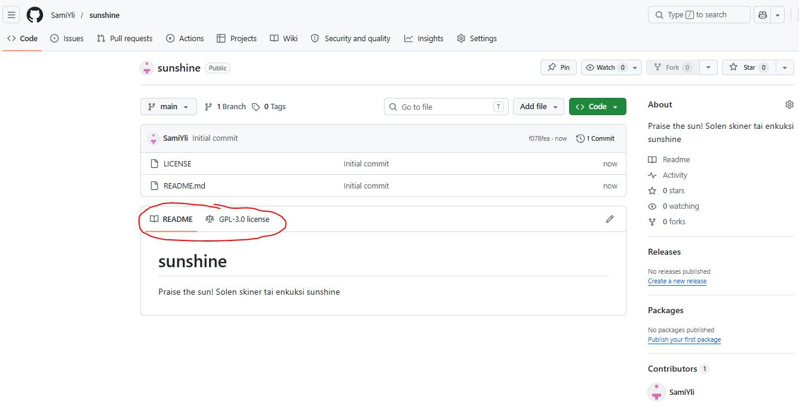

## b) Dolly. 
> Kloonaa edellisessä kohdassa tehty uusi varasto itsellesi, tee muutoksia omalla koneella, puske ne palvelimelle, ja näytä, että ne ilmestyvät weppiliittymään.

 ### Jotta voisin kloonata varaston virtuaalikoneelleni, määritän julkisen ssh avaimen tunnistautumista varten.
 Jotta voin muokata varaston tiedostoja virtuaalikoneellani, minä annan julkisen avaimen tunnistautumista varten.
 Github varaston asetuksista Deploy keys sivulla "Add key". Kopioin tänne julkisen avaimeni. 

 Tässä aiemmissa tehtävissä luotu julkinen avain:
 
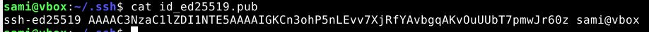

Lisätään se varastoon:

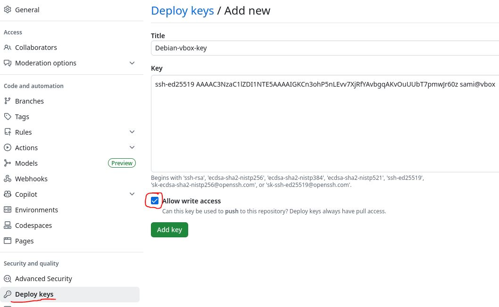

### Onko sinulla jo git? Minullapas on.
Sen voi ladata apt-työkalulla

```
sudo apt install git
```

### Varaston kopiointi.
Kopioin varaston websivulta git ssh-linkin leikepöydälle ja käytän sitä komennossa, jolla kloonaan varaston virtuaalikoneelleni.

```
git@github.com:SamiYli/sunshine.git
```
Git clone komento kopioi varaston koneelleni:
```
git clone git@github.com:SamiYli/sunshine.git
```

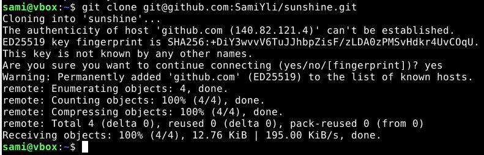

Nyt minulla on varasto kloonattuna hakemistossani

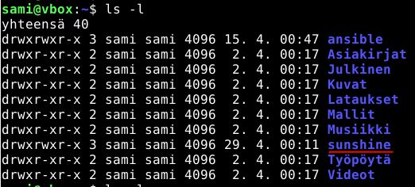

Tein muutoksia, lisäsin tiedoston.

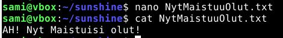

Lisätään muutokset: `git add --all`

Tallennan muutokset: `git commit`

### Epäonnistuminen nr.1.

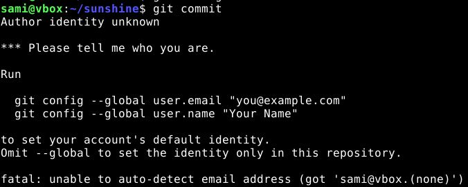

Git ei tunnista kuka olen. Minun pitää ilmeisesti antaa sähköpostini ja käyttäjänimeni.

Pyysin tekoälyltä (chatgpt) komennot:
```
git config user.email "sinun@email.com"
git config user.name "Sinun Nimi"
```
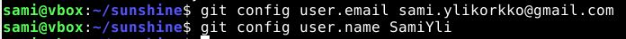

Nyt tietojen täydennyksen jälkeen kokeilen uudelleen ajaa commit-komennon.
Minulle avautui nano tekstieditori jonne pitäisi kirjoittaa commit-viesti:

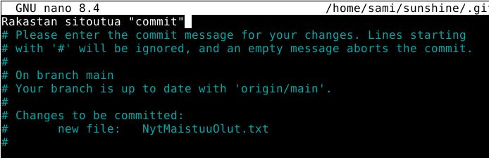

Asetin viestin ilman risuaitaa ja tallensin. Commit oli suoritettu loppuun, kun poistuin nanosta:

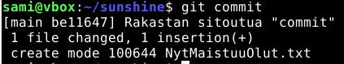

Seuraavaksi työnnän muutokseni github varastoon komennolla:
```
git push
```
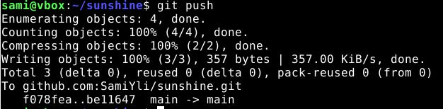

Nyt lisäämäni tiedosto näkyy varaston websivulla:

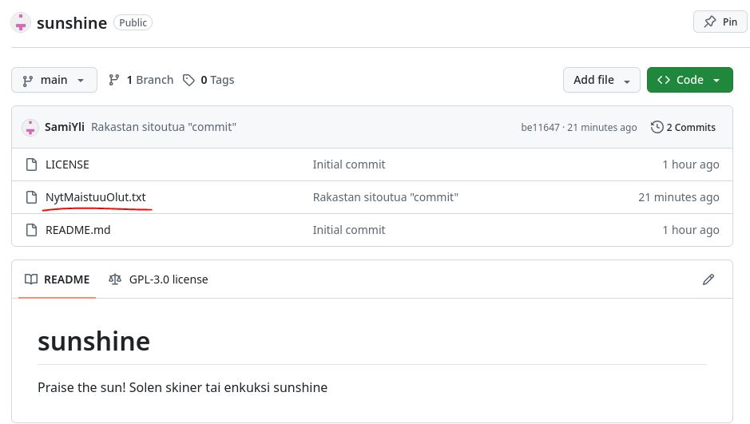

## c) Doh! Tee tyhmä muutos gittiin, älä tee commit:tia. 
> Tuhoa huonot muutokset ‘git reset --hard’. Huomaa, että tässä toiminnossa ei ole peruutusnappia.

### Tein pienen muutoksen NytMaistuisiOlut tiedostoon. 
Nyt siellä on vähän haikeampi toteamus.

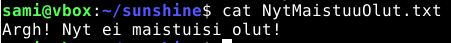

### En tykkää tekemästäni muutoksesta. 
Mitenhän pääsisin ajassa taakseppäin. Kokeillaan palauttaa edellinen tilannekuva. Tämän komennon ajaminen pitäisi palauttaa tiedoston taas aiempaan muotoonsa.:
```
git reset --hard
```

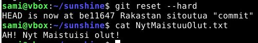

Nyt tiedosto on palautettu edellisen commit-komennon jälkeiseen versioon.


## d) Tukki. Tarkastele ja selitä varastosi lokia.
> Näytä myös, mitä muutoksia tiedostoihin on tehty. Tarkista, että nimesi ja sähköpostiosoitteesi näkyy haluamallasi tavalla ja korjaa tarvittaessa.

### Katselen git logia 
komennolla:
```
git log -p
```
Sain täydentävän idean tekoälyltä (chatgpt) käyttää parametriä -p. Se näyttää eroavaisuudet tilannekuvien välillä.

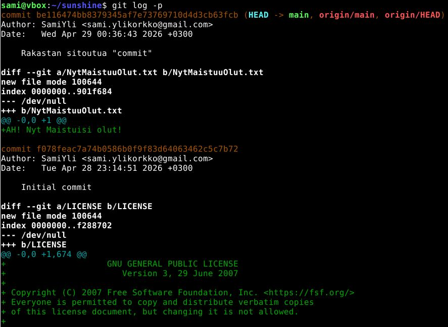

Siellä näkyy, kun varasto on luotu ja lisäämäni tiedoston tallentaminen. Lisättyjen tiedostojen sisältö näkyy vihreällä.

## e) Gitanbile. Laita Ansible-kansio versionhallintaan. 
> Tee jokin muutos, aja ansiblella, tallenna versio (commit).

### Lisään ansible hakemistoni git varastoon.
Kopioin ansible hakemiston rekursiivisesti(alihakemistot mukaan):
```
cp -r ~/ansible ~/sunshine
```
### Valitsen tiedostot commit komentoa varten
```
git add --all
```
### Commit
```
git commit
```
Nyt ansible hakemisto on git versiohallinnassa, mutta se ei ole vielä varastossa.

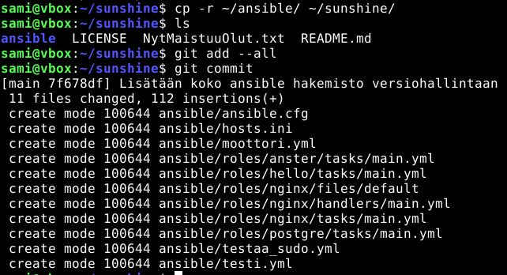

### Työnnän muutokset varastoon
```
git push
```
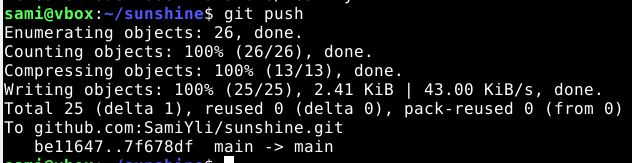

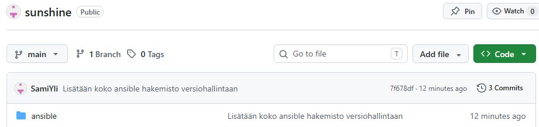

## f) Hae pari projektiin Moodlen keskustelusta.
Minä valitsin Ville Suikin.

## Lähdeluettelo
- Scott Chacon & Ben Straub 2014 2nd Edition: Pro Git (https://git-scm.com/book/en/v2/Getting-Started-What-is-Git%3F) (Luettu 28.4.2026)
